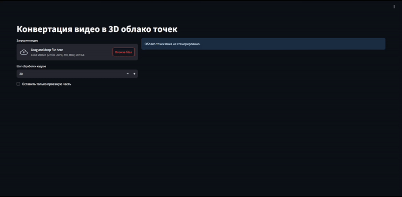

# ReCloud Journey: 3D визуализация на основе видеоданных

**ReCloud Journey** (**Reconstructed Cloud Journey**) — это метод генерации 3D-сцены по видеоданным, использующий нейронные сети для создания цифровых двойников, которые могут быть применены в задачах автономного вождения и моделирования транспортных систем.

Разработанный метод подробно описывает свою архитектуру и этапы реализации. Он включает несколько ключевых компонентов:
* Фильтрация точек на основе сегментации для удаления лишних объектов (транспортные средства, пешеходы и т.д.) с использованием [detr-resnet-50-panoptic](https://huggingface.co/facebook/detr-resnet-50-panoptic).
* Оценка глубины с использованием модели [Distill-Any-Depth](https://github.com/Westlake-AGI-Lab/Distill-Any-Depth).
* Обнаружение ключевых точек и оценка позы камеры с использованием [SuperPoint](https://github.com/magicleap/SuperPointPretrainedNetwork) и [SuperGlue](https://github.com/magicleap/SuperGluePretrainedNetwork).
* Построение плотного 3D облака точек путем точного объединения информации о глубине и позах камеры.

## Пример использования

Ниже представлены визуализации, демонстрирующие возможности проекта.

| Процесс генерации облака точек без фильтрации данных | Процесс генерации облака точек с учетом фильтрации данных |
| :-----------------------: | :---------------------: |
|  |  |

Исходное видео:


Получившееся видео без фильтрации:


Получившееся видео с фильтрацией:


## Инструкции по установке

Чтобы настроить проект на вашем локальном компьютере, выполните следующие шаги:

1.  **Клонируйте репозиторий:**

    ```bash
    git clone [https://github.com/Kweall/RCJ.git](https://github.com/Kweall/RCJ.git)
    cd RCJ
    ```

2.  **Установите зависимости:**

    ```bash
    pip install -r requirements.txt
    ```

3.  **Запустите веб-приложение:**

    ```bash
    streamlit run app.py
    ```

4. **Начните реконструкцию**

Загрузите видео в формате .mp4, выберите шаг обработки, при желании можно включить фильтрацию данных. Нажмите на кнопку "Преобразовать видео в 3D-сцену" и дождитесь обработки. Облако будет визуализировано внутри веб-приложения, а также установлено в директорию ./output